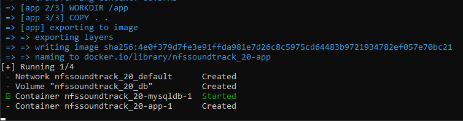
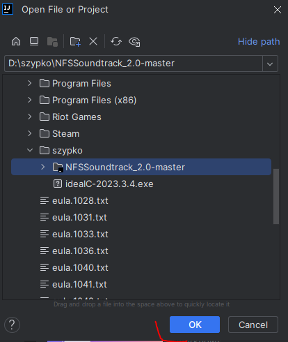
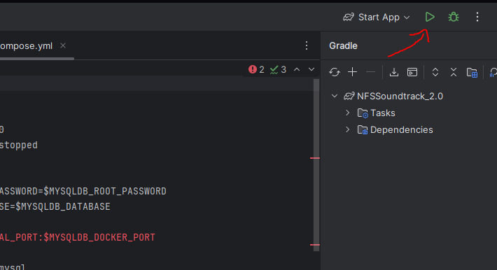

I just want to rewrite NFSSoundtrack.com to handle some stuff better than in 2012.

# How to deploy locally

## Fully via Docker 

1. Download the repo
   1. If you have Git installed on Windows / Linux, use "git clone" command
   2. Otherwise, simply download the ZIP file with repository

2. Unpack the ZIP somewhere and check the content

3. Download Docker Desktop from https://www.docker.com/products/docker-desktop/

4. Install Docker Desktop

5. Restart PC as requested

6. Docker Desktop should automatically start with Windows (you can alter it via Task Manager)

7. Sign up if you wish, but you probably won't like to

8. You will see this message so keep waiting

9. Then you should see such view

10. Open the command line and go to folder with repository - type "docker" to see that it is identified in command line

11. Run the command:

**docker compose -f docker-compose.yml -p nfssoundtrack_20 up -d**

12. You should see after some seconds or maybe couple of minutes this status

13. And it will look like this in Docker Desktop

14. Wait for database to be ready - first it is trying to import data, you can see the "sql" line as indicated by red marking

15. After few minutes it should indicate that it is ready

16. Then the second container should in few seconds start (the one that was 'created' during database import)

17. After some time you should see this message in the command line inside Docker Desktop

18. Then go to https://localhost:8083 - browser will tell you this is not secure, but accept the risk

19. You should see the main page and other stuff working

## Developing / debugging with IntelliJ
1. Install IntelliJ (I use Community Edition) from https://jetbrains.com/idea/download

2. I assume you have the repository downloaded already, so launch IntelliJ and open folder with repository

3. Trust the project

4. It might take some time but things like JDK should be downloaded automatically - check the progress of background tasks visible in bottom right corner

5. Go to Project Structure and double check that Java 17 is used

6. Install Docker plugin to simplify development and deployment a bit

7. Create two configurations: one for mysqldb (so that it is just starting service and not recreating databsae again) and for the app itself

8. Database service config is like this

9. App config is like this

10. Run only the "mysqldb" from docker-compose

11. Check in bottom panel that mysqldb service is started

12. Double check in Docker Desktop too

13. Start the app configuration and look for messages

14. This message should be always shown and indicate that start was good

15. If you want to run all in Docker, then just hit this double-start button in docker-cmpose.yml

16. Hopefully you should be able to go to https://localhost:8082/ and see the website running

## Skip certificate questions

1. If you get prompts in browser about certificate, then simply go to "keystore" folder and install the self-signed certificate

2. Select "Local PC"

3. Continue with import

4. Password can be found in "application.properties" - yourkeystorepass

5. Let Windows automatically store it

6. Finish the import and try to access localhost again

# Generating user password

If you need to have admin user, then I assume you already had to configure IDE to work with this code.
Therefore, recommended is to setup following startup configuration

First argument simply indicates that we want to create new user. Second parameter is user login, third is user password and final parameter is to run it on "dev" default.properties, probably based on local database. You can switch to "prod" or "docker".

Then once you run the project, this code should get triggered in Application.java

After the program starts and you see "successful?" message in the log. Double check then if user is then visible in "user" table.

Then you should be able to go to "admin login" page - https://localhost:8082/login - enter your credentials and be able to work on things as admin.

Then you can go to "Manage" and be able to edit various things in database
